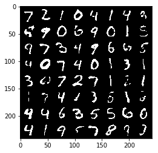
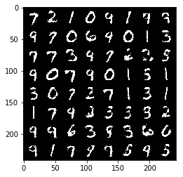
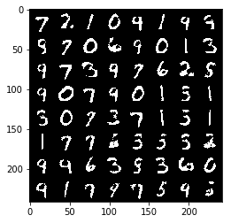
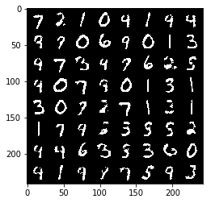
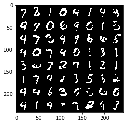
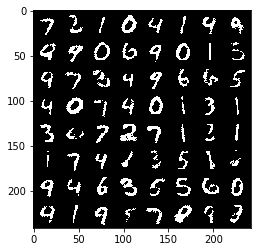
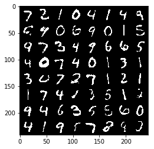
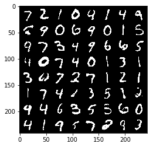

# Denoising Autoencoder for MNIST

This is the pytorch implementation of:
- Autoencoder (AE)
- Denoising Autoencoder (DAE)

# Tutorial

Refer to my blog post:  
[Autoencoders, Denoising Autoencoders, and Variational Autoencoders](https://jaywonchung.github.io/study/machine-learning/Autoencoders/)

# Results
## Autoencoder

Training specs:
- Binarized input images
- Cross-entropy loss
- 10-D latent variable

<table align='center'>
<tr align='center'>
    <td> Input image </td>
    <td> Epoch 1 </td>
    <td> Epoch 5 </td>
    <td> Epoch 10 </td>
</tr>
<tr>
    <td>
    <td>
    <td>
    <td>
</tr>
</table>

## Denoising Autoencoder

Training specs:
- Binarized input images
- Dropout noise (p=0.5) applied to input images

With 2-D latent variable:

<table align='center'>
<tr align='center'>
    <td> Input image </td>
    <td> Noised input image </td>
</tr>
<tr align='center'>
    <td>
    <td>
</tr>
<tr align='center'>
    <td> Epoch 1 </td>
    <td> Epoch 10 </td>
    <td> Epoch 20 </td>
    <td> Epoch 30 </td>
</tr>
<tr align='center'>
    <td>
    <td>
    <td>
    <td>
</tr>
</table>

With 10-D latent variable:

<table align='center'>
<tr align='center'>
    <td> Input image </td>
    <td> Noised input image </td>
</tr>
<tr align='center'>
    <td>
    <td>
</tr>
<tr align='center'>
    <td> Epoch 1 </td>
    <td> Epoch 2 </td>
    <td> Epoch 5 </td>
    <td> Epoch 10 </td>
</tr>
<tr align='center'>
    <td>
    <td>
    <td>
    <td>
</tr>
</table>