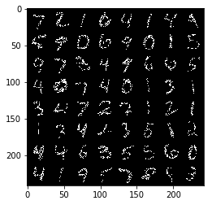

# Denoising Autoencoder for MNIST

This is the pytorch implementation of:
- Autoencoder (AE)
- Denoising Autoencoder (DAE)

# Tutorial

Refer to my blog post:  
[Autoencoders, Denoising Autoencoders, and Variational Autoencoders](https://jaywonchung.github.io/study/machine-learning/Autoencoders/)

# Results
## Autoencoder

Training specs:
- Binarized input images
- Cross-entropy loss
- 10-D latent variable
- Learning rate 3e-4, scaled to 3e-5 at epoch 6

<table align='center'>
<tr align='center'>
    <td> Input image </td>
    <td> Epoch 1 </td>
    <td> Epoch 5 </td>
    <td> Epoch 10 </td>
</tr>
<tr>
    <td>
    <td>
    <td>
    <td>
</tr>
</table>

## Denoising Autoencoder

Training specs:
- Binarized input images
- Dropout noise (p=0.5) applied to input images
- Learning rate 3e-4, scaled to 3e-5 at epoch 6

With 2-D latent variable:

<table align='center'>
<tr align='center'>
    <td> Input image </td>
    <td> Noised input image </td>
</tr>
<tr align='center'>
    <td>
    <td>
</tr>
<tr align='center'>
    <td> Epoch 1 </td>
    <td> Epoch 10 </td>
    <td> Epoch 20 </td>
    <td> Epoch 30 </td>
</tr>
<tr align='center'>
    <td>
    <td>
    <td>
    <td>
</tr>
</table>

With 10-D latent variable:

<table align='center'>
<tr align='center'>
    <td> Input image </td>
    <td> Noised input image </td>
</tr>
<tr align='center'>
    <td>
    <td>
</tr>
<tr align='center'>
    <td> Epoch 1 </td>
    <td> Epoch 2 </td>
    <td> Epoch 5 </td>
    <td> Epoch 10 </td>
</tr>
<tr align='center'>
    <td>
    <td>
    <td>
    <td>
</tr>
</table>

# Usage
## Prerequisites
1. Pytorch and torchvision
2. Packages: numpy, matplotlib

## Execution

Command line:
```bash
python train.py -n True -b True -e 10 -ls 'CE' -lr 3e-4 -z 10 -p 1
```

Jupyter notebook:
```python
from train import main
%matplotlib inline

main(add_noise=True, binarize_input=True, epochs=10, loss='CE', learning_rate=3e-4, latent_dim=10, print_every=1)
```

## Arguments
Every argument is optional, and has a default value defined at ```arguments.py```.

- ```--add_noise, -n```: Whether to add dropout noise to input images. *Default*: - ```True```  
- ```--binarize_input, -b```: Whether to binarize input images (threshold 0.5). *Default*: ```True```
- ```--epochs, -e```: Number of epochs to train. *Default*: ```10```
- ```--loss, -ls```: Which loss function to use. Should be either ```'CE'``` or ```'MSE'```. *Default*: ```'CE'```
- ```--learning_rate, -lr```: Learning rate. This value is decayed to ```lr/10``` at epoch 6. *Default*: ```3e-4```
- ```--latent_dim, -z```: Dimension of the latent variable. *Default*: ```10```
- ```--print_every, -p```: How often to print training progress. *Default*: ```1```

Binarizing the input means that you model the output as a multinoulli distribution. Then using the cross-entropy loss is desirable in the Maximum Likelihood Estimation perspective. On the other hand if you do not binarize the input images, you would be modelling the output as a Multivariate Gaussian distribution. Then using the mean square error is desirable.